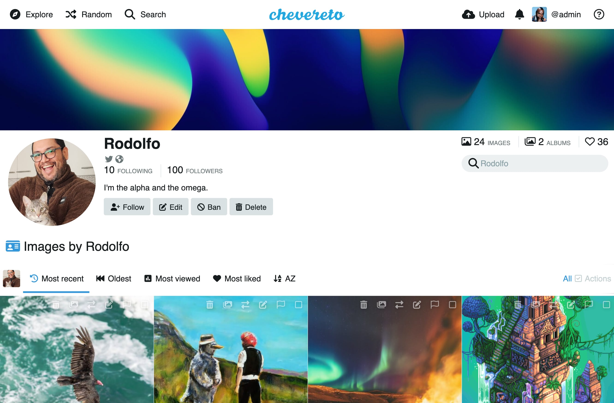

# Chevereto: Ultimate image and video sharing software

> 🔔 [Subscribe](https://chv.to/newsletter) to don't miss any update regarding Chevereto.

    

Chevereto enables to create a media sharing website on your own server. It's your hosting and your rules, say goodbye to closures and restrictions. ⭐️ [Live demo](https://demo.chevereto.com)

Chevereto is a turnkey system which main use case is to provide a self-hosted platform for content creators, communities and businesses. It's features are all about media sharing, with a strong focus on user experience, privacy and security. On its pro edition Chevereto excels as a content management system with heavy business related features that you won't get on other systems.

## Files supported

With Chevereto you can upload and share the following media types from device file browser, drag and drop, on-the-fly device camera (video and photos), clipboard, URL, ShareX and via API.

- image/jpeg
- image/gif
- image/png
- image/webp
- image/bmp
- video/quicktime
- video/mp4
- video/webm

## Documentation

Chevereto is so **feature-rich**, mature and robust that we need three layers of documentation for it. The project started on 2007 and it has been actively maintained since then.

- [Documentation](https://v4-docs.chevereto.com)
- [User manual](https://v4-user.chevereto.com/)
- [Admin manual](https://v4-admin.chevereto.com/)

## Compare features

**Note:** This is the repository for Chevereto free edition. This software is intended for **personal usage** as it doesn't contain [all the features](https://chevereto.com/features) of commercial editions. This is a short, not exhaustive, list of features available on Chevereto editions. Feel free to request a free demo of the pro edition at [chevereto.com](https://chevereto.com) to see all the features in action.

| Feature                                                                         | Free     | Pro                   |
| ------------------------------------------------------------------------------- | -------- | --------------------- |
| Image & Video uploads                                                           | ✅        | ✅                     |
| ShareX support                                                                  | ✅        | ✅                     |
| Supports 360° images                                                            | ✅        | ✅                     |
| User profiles                                                                   | ✅        | ✅                     |
| Albums & Sub-albums                                                             | ✅        | ✅                     |
| Categories                                                                      | ✅        | ✅                     |
| Search                                                                          | ✅        | ✅                     |
| Direct links                                                                    | ✅        | ✅                     |
| Delete link                                                                     | ✅        | ✅                     |
| Sharing                                                                         | ✅        | ✅                     |
| oEmbed                                                                          | ✅        | ✅                     |
| Admin web interface                                                             | ✅        | ✅                     |
| Media, Album and Users listings                                                 | ✅        | ✅                     |
| EXIF data                                                                       | ✅        | ✅                     |
| User-based API                                                                  | ✅        | ✅                     |
| Two-Factor Authentication (2FA)                                                 | ✅        | ✅                     |
| Call-to-action album buttons                                                    | ✅        | ✅                     |
| Random button                                                                   | ✅        | ✅                     |
| Encrypt secrets                                                                 | ✅        | ✅                     |
| System stats & usage                                                            | ✅        | ✅                     |
| Custom semantics                                                                | ✅        | ✅                     |
| One-click upgrade (web & CLI)                                                   | ✅        | ✅                     |
| Theme palettes (10)                                                             | ✅        | ✅                     |
| Custom JS & CSS                                                                 | ✅        | ✅                     |
| Supports GD & ImageMagick                                                       | ✅        | ✅                     |
| Duplicate media detection                                                       | ✅        | ✅                     |
| Docker support                                                                  | ✅        | ✅                     |
| CLI commands                                                                    | ✅        | ✅                     |
| Multiple languages (configurable)                                               | ✅        | ✅                     |
| Website mode (public, private)                                                  | ✅        | ✅                     |
| Default timezone selection                                                      | ✅        | ✅                     |
| Enable/disable NSFW listings                                                    | ✅        | ✅                     |
| Enable/disable blur NSFW content                                                | ✅        | ✅                     |
| Classic + Endless scroll listings                                               | ✅        | ✅                     |
| Configurable listings                                                           | ✅        | ✅                     |
| Anywhere uploader                                                               | ✅        | ✅                     |
| Embed codes on upload complete                                                  | ✅        | ✅                     |
| Embed codes on selected media                                                   | ✅        | ✅                     |
| Embed codes media view                                                          | ✅        | ✅                     |
| Expirable uploads                                                               | ✅        | ✅                     |
| Storage modes (date, direct)                                                    | ✅        | ✅                     |
| Filenaming (original, id, random, mixed)                                        | ✅        | ✅                     |
| Thumbs & medium sized images                                                    | ✅        | ✅                     |
| CDN support (any)                                                               | ✅        | ✅                     |
| Maintenance mode                                                                | ✅        | ✅                     |
| Crypt-salted IDs (no public integer ids)                                        | ✅        | ✅                     |
| Comments API (Disqus, any JS)                                                   | ✅        | ✅                     |
| Email SMTP + phpmail()                                                          | ✅        | ✅                     |
| Test-email tool                                                                 | ✅        | ✅                     |
| Debugger included ([xrDebug](https://xrdebug.com))                              | ✅        | ✅                     |
| REPL included ([PsySH](https://psysh.org), [Tinkerwel](https://tinkerwell.app)) | ✅        | ✅                     |
| Source code available                                                           | ✅        | ✅                     |
| Maximum resolution                                                              | No limit | No limit              |
| License                                                                         | AGPLv3   | Not-AGPL              |
| Roles                                                                           | admin    | admin, manager & user |
| Multiple users & management                                                     | –        | ✅                     |
| Multiple external storage servers                                               | –        | ✅                     |
| Explore & Discovery                                                             | –        | ✅                     |
| Advanced search                                                                 | –        | ✅                     |
| Followers                                                                       | –        | ✅                     |
| Guest API                                                                       | –        | ✅                     |
| Likes                                                                           | –        | ✅                     |
| Manage banners                                                                  | –        | ✅                     |
| Consent screen (age gate)                                                       | –        | ✅                     |
| Bulk content importer                                                           | –        | ✅                     |
| Stop words                                                                      | –        | ✅                     |
| Custom homepage                                                                 | –        | ✅                     |
| Custom logo                                                                     | –        | ✅                     |
| Custom pages                                                                    | –        | ✅                     |
| Custom routing                                                                  | –        | ✅                     |
| Cookie consent                                                                  | –        | ✅                     |
| Notifications                                                                   | –        | ✅                     |
| Queue handling                                                                  | –        | ✅                     |
| IP banning                                                                      | –        | ✅                     |
| Upload moderation                                                               | –        | ✅                     |
| Upload plugin (PUP.js)                                                          | –        | ✅                     |
| Image watermarks                                                                | –        | ✅                     |
| External services support                                                       | –        | ✅                     |
| StopForumSpam                                                                   | –        | ✅                     |
| ModerateContent                                                                 | –        | ✅                     |
| Project Arachnid                                                                | –        | ✅                     |
| Auth providers (OAuth2)                                                         | –        | ✅                     |

## Supported servers

Chevereto runs anywhere, system requirements are minimal and it can run on any server.

- Shared hosting ([cPanel](https://v4-docs.chevereto.com/guides/cpanel/), [Plesk](https://v4-docs.chevereto.com/guides/plesk/), DirectAdmin, Installatron, Softaculous, etc)
- [VPS](https://v4-docs.chevereto.com/guides/server/vps) (DigitalOcean, Linode, Vultr, etc)
- [Docker](https://github.com/chevereto/docker) (Multi-arch image compatible with `x86_64` and `arm64`)
  - [PURE DOCKER](https://v4-docs.chevereto.com/guides/docker/pure-docker)
  - [Chevereto Docker](https://v4-docs.chevereto.com/guides/docker/)

## License

### Open Source license

Copyright [Rodolfo Berríos Arce](http://rodolfoberrios.com) - [AGPLv3](LICENSE).

This program is free software: you can redistribute it and/or modify it under the terms of the GNU Affero General Public License as published by the Free Software Foundation, either version 3 of the License, or (at your option) any later version.

This program is distributed in the hope that it will be useful, but WITHOUT ANY WARRANTY; without even the implied warranty of MERCHANTABILITY or FITNESS FOR A PARTICULAR PURPOSE. See the GNU Affero General Public License for more details.

You should have received a copy of the GNU Affero General Public License along with this program. If not, see [GNU Licenses](http://www.gnu.org/licenses/).

### Commercial license

The commercial license is designed to for you to use Chevereto in commercial products and applications, without the provisions of the AGPLv3. With the commercial license, your code is kept proprietary, to yourself. See the Chevereto Commercial License at [chevereto.com](https://chevereto.com/license)
